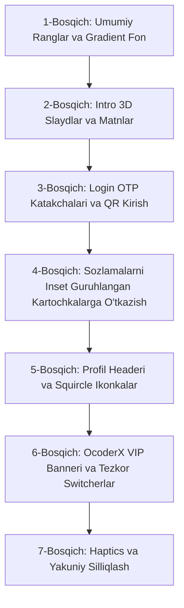

# Tizim Ko'rinishi (Intro, Login va Sozlamalar) Dizaynini Zamonaviylashtirish Bo'yicha Tavsiyalar

Ushbu hujjatda ilovaning kirish qismini (Intro va Login ekranlari) hamda asosiy Sozlamalar (Settings / Profil) oynasini eng so'nggi UI/UX trendlariga (Material You, Telegram Premium, iOS Inset Grouped uslublari) moslashtirish, foydalanuvchi tajribasini (UX) yaxshilash va vizual ko'rinishni premium darajaga olib chiqish bo'yicha to'liq tavsiyalar hamda texnik yo'l xaritasi jamlangan.

---

# I QISM. Tizimga Kirish (Intro & Login) Qismi

## 1. Vizual Ko'rinish va Estetika (Visual & Theme Upgrades)

### 1.1. Dinamik va Silliq Gradient Fon (Mesh / Fluid Gradient Background)
* **Muammo:** Standart oq yoki qora bir xil (flat) rangli fon foydalanuvchida eskirgan ilova taassurotini qoldiradi.
* **Yechim:** Telegram Premium uslubidagi orqa fonda sekin harakatlanuvchi *Fluid Mesh Gradient* yoki nozik blur effekti qo'shish.
* **Qo'llash:** `Canvas` ustida `RadialGradient` yoki `LinearGradient` qatlamlarini `ValueAnimator` orqali sekin siljitish orqali erishiladi.

### 1.2. Glassmorphism va Xiralashtirilgan Oyna (Frosted Glass Effect)
* **Yechim:** Kirish maydonlari (input cards), til tanlash paneli va pastki boshqaruv tugmalari orqa foniga shaffof xiralashtirilgan fon berish.
* **Qo'llash:** Android 12+ uchun `RenderEffect.createBlurEffect()`, undan oldingi versiyalar uchun yarim shaffof rang (`#1AFFFFFF` / `#1A000000`) va nozik oq chegara (`border: 1dp solid rgba(255,255,255,0.15)`).

### 1.3. Material You / Dynamic Colors (Monet Tizimi)
* **Yechim:** Android 12 va undan yuqori qurilmalarda tizim devor qog'ozi ranglar palitrasiga avtomatik moslashuvchi ranglar mavzusini qo'llab-quvvatlash.

### 1.4. Zamonaviy Tipografiya
* Shriftlarni zamonaviyroq va o'qishga qulay variantlarga (*Google Sans*, *Inter*, *Outfit*) almashtirish.
* Sarlavhalar va matnlar orasidagi masofalarni (line height va letter spacing) kengroq, toza (clean aesthetic) qilib sozlash.

---

## 2. Intro / Onboarding Sahifasi (`IntroActivity`)

### 2.1. 3D va Zamonaviy Lottie/RLottie Animatsiyalar
* Eskirgan 2D/OpenGLES chizmalari o'rniga yangi avlod **3D render qilingan `.tgs` (Telegram Sticker) yoki Lottie animatsiyalari**:
  * 3D uchuvchi qog'oz samolyot (Branding);
  * 3D xavfsizlik va shifrlash qulfi (Security);
  * 3D bulutli sinxronizatsiya (Cloud storage);
  * 3D tezkor xabarlar / chaqmoq (Speed).

### 2.2. Parallaksli Kartochkali Karusel (Interactive Parallax Carousel)
* Sahifalarni chapga-o'ngga surgan paytda:
  * Fon rasmlari / gradientlar sekinroq siljiydi;
  * 3D ikonka o'rtacha tezlikda aylanadi;
  * Matnlar silliq o'tib joyiga tushadi. Bu foydalanuvchiga chuqurlik (depth) va interaktivlik hissini beradi.

### 2.3. Dasturning O'ziga Xos Imkoniyatlarini Ko'rsatish
* Standart Telegram yozuvlari o'rniga ilovangizning eng kuchli jihatlarini birinchi ekrandan tanishtirish:
  * *Ghost Mode / Maxfiy rejim;*
  * *O'chirilgan xabarlarni saqlash;*
  * *Kengaytirilgan yuklash tezligi va cheklovlarsiz fayllar;*
  * *Maxsus vizual mavzular va moslashuvchanlik.*

### 2.4. Animatsiyali "Kun / Tun" Almashinuvi
* Ekranning yuqori burchagidagi quyosh/oy tugmasi bosilganda butun ekran bo'ylab silliq dumaloq yorug'lik to'lqini (*Circular Reveal Transition*) bilan mavzu o'zgarishi.

---

## 3. Autentifikatsiya va Login Bosqichi (`LoginActivity`)

### 3.1. Segmented OTP Input (Zamonaviy Tasdiqlash Kod Katakchalari)
* SMS yoki Telegram orqali kelgan kodni bitta uzun qatorda emas, **alohida yumaloq ramkali katakchalarda (Pill/Square OTP Boxes)** kiritish:
  * Har bir raqam kiritilganda nozik "sakrash" (*Pop/Scale*) animatsiyasi;
  * Kod noto'g'ri kiritilganda butun quti qizil rangga kirib, nozik silkinishi (*Shake animation*) va taktil vibratsiya berishi.

### 3.2. QR-Kod Orqali Tezkor Kirish (Quick QR Login)
* Telefon raqam kiritish oynasining o'zidayoq Telegram Desktop / Web orqali skanerlab darhol kirish imkoniyatini ko'rinadigan qulay tugma yoki tab shaklida joylashtirish.

### 3.3. Zamonaviy Mamlakat Tanlash (Country Picker BottomSheet)
* To'liq ekranli eski oyna o'rniga zamonaviy **Bottom Sheet Dialog**:
  * Yuqori sifatli SVG bayroqlar;
  * Tezkor qidiruv paneli;
  * So'nggi tanlangan yoki avtomatik aniqlangan mamlakatning tepada ajratib ko'rsatilishi.

### 3.4. Biometriya va Passkey Yordamida Kirish
* Agar qurilmada oldin hisob ochilgan bo'lsa yoki 2FA paroli mavjud bo'lsa, barmoq izi (Fingerprint / Face Unlock) orqali tasdiqlash imkoniyatini berish.

---

## 4. Mikro-animatsiyalar va Foydalanish Qulayligi (UX & Haptics)

* **Taktil Aloqa (Haptic Feedback):**
  * Raqam terilganda, tugma bosilganda yoki xato ro'y berganda turli kuchdagi yengil tebranish berish (`HapticFeedbackConstants.KEYBOARD_TAP` / `VIRTUAL_KEY`).
* **Tugma Animatsiyalari (Spring Bounce & Shimmer):**
  * "Boshlash" yoki "Davom etish" tugmasiga bosilganda o'lchamining 96% ga qisqarib qayta tiklanishi (*Spring scale bounce*) va tugma bo'ylab harakatlanuvchi nur (*Shimmer effect*).
* **Shared Element Transitions:**
  * Intro ekranidan Login sahifasiga o'tganda logo va tugmalarning sakramasdan, o'zining yangi pozitsiyasiga silliq uchib o'tishi.

---

# II QISM. Sozlamalar va Profil Sahifasi (`ProfileActivity` / Settings)

## 5. Profil Qismining Yangi Dizayni (Profile Header Redesign)

### 5.1. Dinamik / Blurred Profil Foni
* Foydalanuvchining avatari ranglar palitrasiga qarab avtomatik moslashuvchi silliq xiralashtirilgan fon (*Dynamic Palette Blur*) yoki Telegram Premium uslubidagi animatsiyali gradient to'lqin.

### 5.2. Gradientli Avatar Ramkasi va Status Chip
* Avatar atrofiga yorqin nozik gradientli ramka (*Story Ring / Animated Gradient Border*).
* Ism yonida foydalanuvchining emoji-statusi yoki maxsus belgisini (Badge) chiroyli chip ko'rinishida chiqarish.

### 5.3. Tezkor Harakatlar Paneli (Quick Action Grid)
* Profil tagida 4 ta qulay mini-tugma:
  1. 📷 **Avatar o'zgartirish**
  2. 🔗 **Username nusxalash**
  3. 🏁 **QR-kod bilan ulashish**
  4. ⚙️ **Tezkor tahrirlash**

### 5.4. Ko'p Hisoblar (Multi-Account) Karuseli
* Boshqa hisoblarga o'tish uchun yon menyuni (Drawer) ochib o'tirmasdan, to'g'ridan-to'g'ri sozlamalar headerida boshqa hisoblar avatarlarini gorizontal karusel shaklida ko'rsatish (1 bosish bilan hisob almashadi).

---

## 6. Guruhlangan Kartochkalar Tartibi (Grouped Inset Cards Layout)

* **Material 3 / iOS Uslubidagi Modulli Bloklar:**
  * Sozlamalarning cheksiz uzun ro'yxati o'rniga har bir bo'limni alohida yumaloq burchakli (16–20dp radius) **kartochkalarga (Cards)** ajratish:
    * 🔹 **Hisob & Xavfsizlik:** Telefon raqam, Username, Maxfiylik va Parol.
    * 🔹 **Xabarlar & Bildirishnomalar:** Chat sozlamalari, Bildirishnomalar, Ovozlar.
    * 🔹 **Xotira & Tarmoq:** Kesh xotira, Ma'lumotlar sarfi, Batareya tejash.
    * 🔹 **OcoderX Maxsus Imkoniyatlari:** Ghost mode, O'chirilgan xabarlar, Qo'shimcha vositalar.

---

## 7. Gradientli "Squircle" Ikonka Badjlari (Modern Icon Badges)

* **Jonli Rangli Mini-Badjlar:**
  * Oddiy kulrang yoki bir tusli ikonkalar o'rniga yumaloq-to'rtburchak (Squircle) shaklidagi rang-barang gradientli fon ichiga joylashtirilgan oq vektor ikonkalar:
    * 🔔 **Bildirishnomalar:** Qizil/Olovrang gradient
    * 🔒 **Maxfiylik va Xavfsizlik:** Binafsha/Moviy gradient
    * 🎨 **Mavzu va Ko'rinish:** Kamalak/Pushti gradient
    * 💾 **Xotira va Ma'lumotlar:** Yashil/Feruza gradient
    * ⚡ **OcoderX sozlamalari:** Oltin/Neon ko'k gradient

---

## 8. OcoderX / Maxsus Sozlamalar Uchun VIP Banner va Tezkor Switcherlar

### 8.1. Jilolanuvchi VIP Banner (Shimmering Promo Card)
* Sozlamalar ro'yxatining eng yuqori qismida dasturingizning eksklyuziv modifikatsiyalari (Ghost Mode, O'chirilgan xabarlar arxivi, Yuklash tezlatgichi) uchun ko'zga tashlanadigan yorqin gradientli maxsus kartochka.

### 8.2. Tezkor Switcherlar (Quick Toggles in Settings)
* Ichki menyularga kirmasdan, asosiy sozlamalar oynasining o'zidayoq eng ko'p ishlatiladigan funksiyalarni (*Ghost Mode yoqish*, *Yashirin o'qish*) bitta switch orqali yoqish/o'chirish imkoniyati.

---

## 9. Xotira va Kesh Vizual Ko'rsatkichi (Visual Storage Meter)

* **Rangli Xotira Progress-Bari:**
  * "Xotira va ma'lumotlar" bo'limida shunchaki quruq matn o'rniga qurilma xotirasining qancha qismi Telegram/Kesh tomonidan band qilinganini ko'rsatuvchi interaktiv chiziqli diagramma:
    * 🟦 *Videolar (2.4 GB)*
    * 🟩 *Rasmlar (800 MB)*
    * 🟧 *Boshqa fayllar (300 MB)*
  * Yonida bitta bosish bilan keshni tozalash tugmasi (*Quick Clear Cache*).

---

## 10. Qidiruv va Taktil Boshqaruv (Search & Haptics)

* **Tepadagi Qulay Qidiruv Paneli:**
  * Sozlamalarni pastga tortganda (pull-down) silliq ochiladigan qidiruv maydoni orqali foydalanuvchi istalgan parametrni sekund ichida topa olishi.
* **Taktil Vibratsiya (Haptic Feedback):**
  * Switch'lar yoqilganda/o'chirilganda, kartochkalar bosilganda yengil tebranish berish.

---

# III QISM. Loyihada O'zgartiriladigan Asosiy Fayllar Xaritasi

| Fayl Yo'li | Qaysi Qismga Tegishli | Asosiy Vazifasi va O'zgarishlar |
| :--- | :--- | :--- |
| `org/telegram/ui/IntroActivity.java` | **Intro** | Kirish slaydlari, 3D animatsiyalar, sarlavhalar, pastki "Start" tugmasi dizayni. |
| `org/telegram/ui/LoginActivity.java` | **Login** | Telefon raqam kiritish, OTP kod katakchalari, mamlakat tanlash, QR kirish usuli. |
| `org/telegram/ui/ProfileActivity.java` | **Sozlamalar** | Profil headeri, sozlamalar ro'yxati arxitekturasi va kartochkalar tartibi. |
| `org/telegram/ui/Cells/TextSettingsCell.java` | **Sozlamalar** | Sozlamalar qatori dizayni, squircle gradientli ikonka badjlari. |
| `org/telegram/ui/Cells/HeaderCell.java` | **Sozlamalar** | Kartochkalar sarlavhalari dizayni va ajratuvchilar. |
| `com/radolyn/ayugram/ui/preferences/` | **OcoderX Sozlamalari** | Maxsus modifikatsiya menyulari va sozlamalar oynalari. |
| `org/telegram/ui/ActionBar/Theme.java` | **Umumiy Dizayn** | Ranglar, gradientlar, fon xiralashtirish, kartochkalar va tugma uslublari. |
| `TMessagesProj/src/main/res/raw/` | **Resurslar** | Yangi 3D `.tgs` yoki `.json` Lottie animatsiya resurslari joylanadigan papka. |

---

# IV QISM. Bosqichma-bosqich Amalga Oshirish Rejasi (Roadmap)

1. **1-Bosqich:** Fluid Gradientli fon va zamonaviy ranglar temasini sozlash.
2. **2-Bosqich:** `IntroActivity` dagi 3D animatsiyalar va o'ziga xos imkoniyatlar matnini yangilash.
3. **3-Bosqich:** `LoginActivity` dagi raqam kiritish va OTP katakchalarini zamonaviy dizaynga o'tkazish.
4. **4-Bosqich:** `ProfileActivity` va `TextSettingsCell` ni guruhlangan kartochkalar (Inset Grouped Cards) shakliga o'tkazish.
5. **5-Bosqich:** Profil headeri, xiralashtirilgan fon, ko'p hisoblar karuseli va squircle gradientli ikonkalar qo'shish.
6. **6-Bosqich:** OcoderX maxsus sozlamalari uchun jilolanuvchi VIP banner va asosiy ekranga tezkor switcherlarni joylash.
7. **7-Bosqich:** Barcha tugmalar, switch'lar va o'tishlarga taktil (haptic) aloqalarni ulash.
